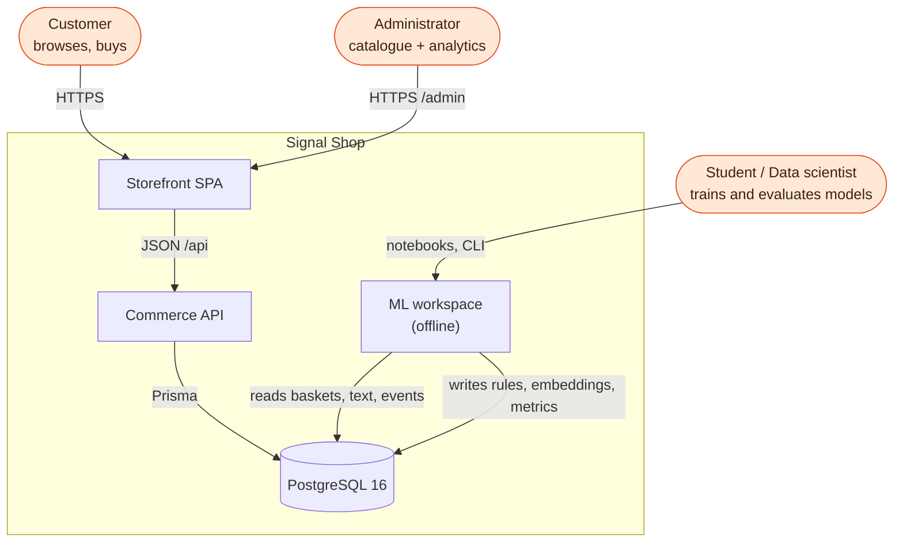
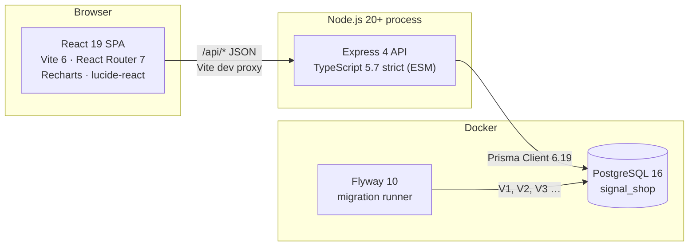
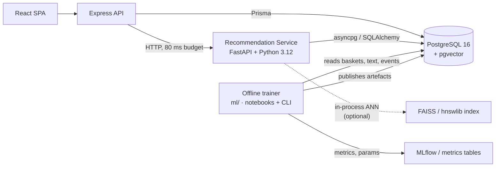
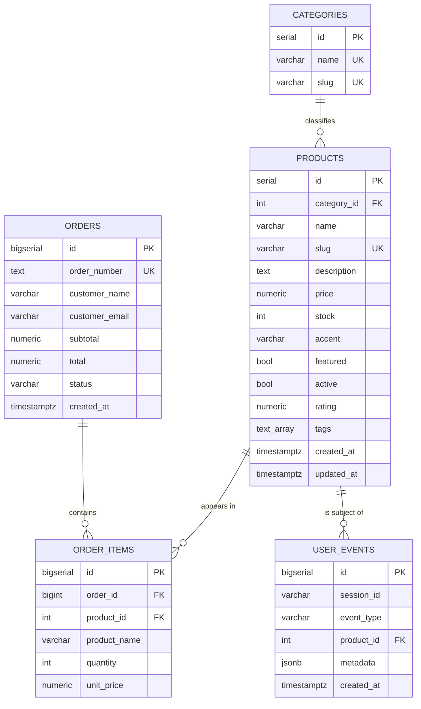
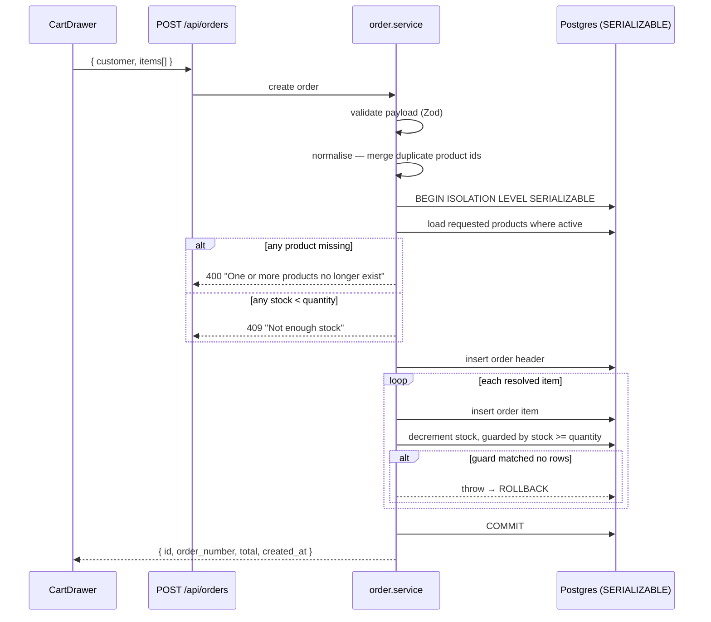
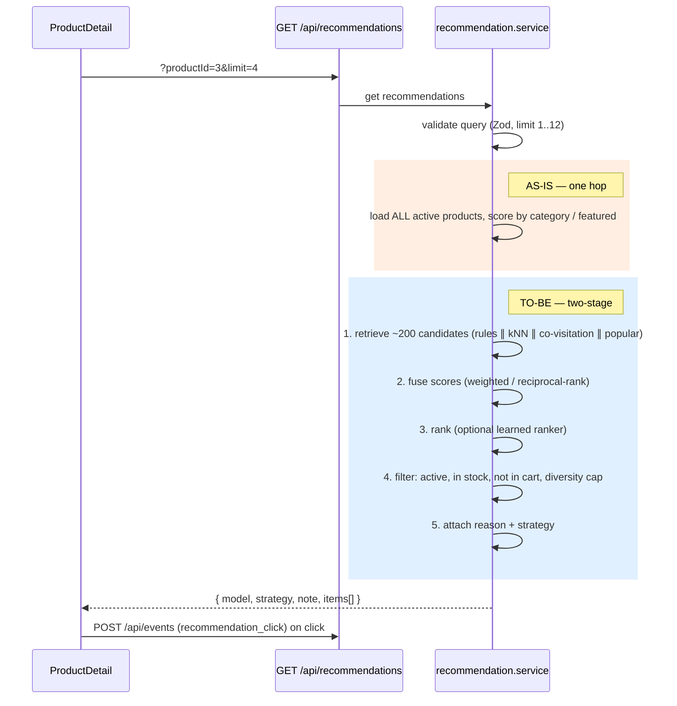
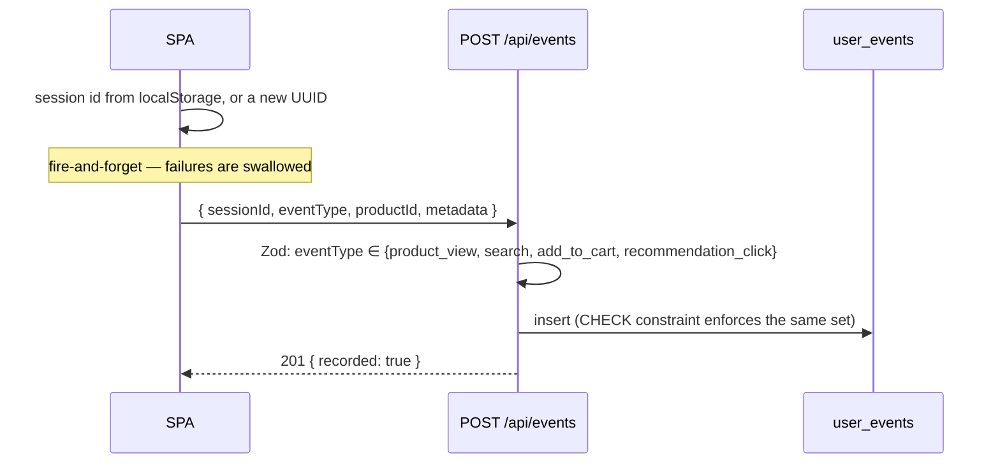
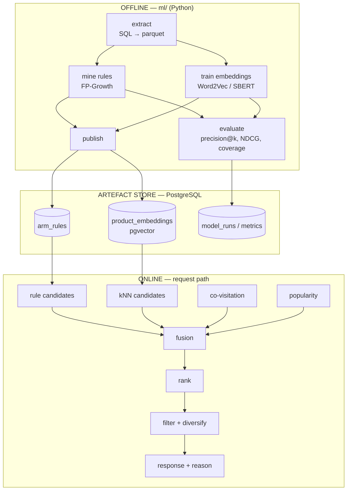

# Signal Shop — System Architecture

> Course: **Exploring Intelligent Systems, Semester II-2026** · Lab deliverable for the topics
> **Association Rules Mining**, **Recommender Systems** and **Word Embedding**.
>
> Companion document: [`ML_STACK.md`](./ML_STACK.md) — the machine-learning stack for the three topics.
>
> **This is a design document, not a code listing.** It describes structure, contracts, behaviour and
> the reasoning behind each decision. Implementation lives in the repository; where a rule is
> enforced by a specific file, the file is named so it can be read directly.

This document describes the architecture in two tenses:

- **AS-IS** — what exists in the repository today (a working storefront whose recommender is an
  honest, self-labelling placeholder).
- **TO-BE** — the target architecture once the intelligent components are added, laid out the way a
  real production recommender is built (offline training → artifact publication → online serving,
  with a fallback chain and measurable output).

Everything in the TO-BE section is designed to be reachable from the AS-IS system **without
rewriting the frontend or the HTTP contract**. That is the central architectural bet of this
project, and §7 explains why it holds.

---

## Table of contents

1. [Architectural drivers](#1-architectural-drivers)
2. [System context (C4 level 1)](#2-system-context-c4-level-1)
3. [Container view (C4 level 2)](#3-container-view-c4-level-2)
4. [Backend component architecture (C4 level 3)](#4-backend-component-architecture-c4-level-3)
5. [Frontend architecture](#5-frontend-architecture)
6. [Data architecture](#6-data-architecture)
7. [The recommendation seam](#7-the-recommendation-seam)
8. [Runtime flows](#8-runtime-flows)
9. [Cross-cutting concerns](#9-cross-cutting-concerns)
10. [Target architecture with the ML pipeline](#10-target-architecture-with-the-ml-pipeline)
11. [Deployment and environments](#11-deployment-and-environments)
12. [Architecture decision records](#12-architecture-decision-records)
13. [Quality attributes and failure modes](#13-quality-attributes-and-failure-modes)
14. [Repository layout](#14-repository-layout)
15. [Glossary](#15-glossary)

---

## 1. Architectural drivers

### 1.1 Functional drivers

| # | Driver | Where it lands |
| --- | --- | --- |
| F1 | Customers browse, search and filter a catalogue | `modules/products`, `modules/categories` |
| F2 | Customers open a product page and see contextual suggestions | `pages/ProductDetail`, `modules/recommendations` |
| F3 | Customers manage a persistent cart and complete a demo checkout | `CartDrawer`, `modules/orders` |
| F4 | Every checkout is captured as a **transaction basket** | `orders` + `order_items` |
| F5 | Every meaningful interaction is captured as an **event** | `user_events` |
| F6 | Administrators see sales analytics and manage the catalogue | `pages/Admin`, `modules/admin` |
| F7 | Recommendations are **replaceable** without touching the UI | §7 |

### 1.2 Quality attributes (ranked)

1. **Modifiability of the recommender** — the lab exists to swap one component. Everything else is
   subordinate to keeping that swap cheap.
2. **Data fidelity** — a basket that is wrong is a rule that is wrong. Checkout writes are
   transactional and serializable; the ML pipeline inherits a trustworthy training set.
3. **Type safety at the boundary** — TypeScript `strict` plus runtime Zod validation, so untrusted
   input cannot reach the domain layer unshaped.
4. **Demonstrability** — the system must start on a laptop with two commands and degrade gracefully
   when the API is down (preview mode), because it will be demonstrated and graded.
5. **Observability of the model** — every recommendation response names the model and strategy that
   produced it. Without that, the evaluation section of the lab is unwritable.

**Explicit non-goals.** Authentication, authorization, real payments, horizontal scale, multi-tenant
concerns, GDPR/PII lifecycle. This is a course prototype and the README says so; the architecture
does not pretend otherwise.

### 1.3 Constraints imposed by the assignment

| Constraint | Architectural consequence |
| --- | --- |
| Lab source code must be a **Jupyter Notebook or Python script** | The ML layer is a **separate Python workspace** (`ml/`), not TypeScript. This is also what real systems do — see ADR-006. |
| The lab must document a **dataset (source and structure)** | Extraction is a first-class, versioned pipeline stage, not an ad-hoc query. |
| The lab must **analyse output results** | Evaluation is a pipeline stage with persisted metrics, not a print statement. |
| Grading rewards **explainability** ("clear explanation of concepts") | Every recommendation carries a reason derived from the rule or neighbour that produced it. |

---

## 2. System context (C4 level 1)



There is exactly one external dependency — the PostgreSQL instance. No payment provider, no email
provider, no third-party recommendation SaaS. That is deliberate: the recommendation quality in this
system is entirely attributable to work the student did, which is what is being graded.

---

## 3. Container view (C4 level 2)

### 3.1 AS-IS



| Container | Technology | Responsibility | Entry point |
| --- | --- | --- | --- |
| Storefront SPA | React 19, Vite 6, React Router 7 | Rendering, cart state, session identity, event emission, offline fallback | `client/src/main.jsx` |
| Commerce API | Express 4, TypeScript 5.7 (`strict`, `NodeNext` ESM) | HTTP contract, validation, domain rules, persistence orchestration | `server/src/server.ts` |
| Database | PostgreSQL 16 (Alpine) | Catalogue, orders, baskets, event log | `docker-compose.yml` |
| Migration runner | Flyway 10 | **Sole owner of DDL**; runs on `npm run db:start` | `server/db/migrations/` |

### 3.2 TO-BE (adds two containers)



Two new containers, and **one of them is optional**: §10.4 describes an in-process variant where the
Express API reads the published artefacts (`arm_rules`, `product_embeddings` with pgvector) directly
and no Python process runs at request time. Both are legitimate real-world topologies; the trade-off
is spelled out in ADR-007.

---

## 4. Backend component architecture (C4 level 3)

### 4.1 The module rule

The API is organised **by feature, not by technical layer**. Every feature under
`server/src/modules/<feature>/` contains the same five files, and the dependency arrows only ever
point one way:

```
routes.ts  →  controller.ts  →  service.ts  →  repository.ts  →  Prisma
   │               │                │
   └───────────────┴────────────────┴──→ dto.ts   (Zod schema + TypeScript interfaces)
```

| File | Allowed to know about | Forbidden from |
| --- | --- | --- |
| `*.routes.ts` | Express `Router`, the controller, the async handler | Business logic, Prisma |
| `*.controller.ts` | Request/response objects, the service, DTO types | Prisma, validation logic, SQL |
| `*.service.ts` | DTO parsers, repositories, the error type, transactions | Request/response objects, Prisma models |
| `*.repository.ts` | Prisma client, mappers | HTTP, Zod, business rules |
| `*.dto.ts` | Zod, other DTO types | Everything else |

This is the classic **ports-and-adapters** shape reduced to what one person actually maintains. The
payoff is concrete and is the whole point of §7: the recommendation service can be rewritten end to
end without any other file in the repository changing.

### 4.2 Module inventory (AS-IS)

| Module | Routes | Notes |
| --- | --- | --- |
| `products` | `GET /api/products`, `GET /api/products/:id` | Filters on `search`, `category`, `featured`. Search is **lexical** (case-insensitive substring on name/description, exact match on a tag) — the baseline the embedding work will be measured against. |
| `categories` | `GET /api/categories` | Returns a count of active products per category. |
| `orders` | `POST /api/orders` | The basket writer. Serializable transaction, stock guard, line-item deduplication. |
| `events` | `POST /api/events` | Append-only interaction log. Four allowed types, enforced by both Zod and a database `CHECK` constraint. |
| `recommendations` | `GET /api/recommendations` | **The seam.** Currently reports itself as `hybrid-placeholder-v0`. |
| `admin` | `GET /overview`, CRUD `/products` | Aggregation for the dashboard; product CRUD delegates to the products service rather than duplicating it. |

### 4.3 Shared kernel

| File | Purpose | Why it is shared rather than duplicated |
| --- | --- | --- |
| `shared/AppError.ts` | An error type carrying an HTTP status code | One error type the handler can discriminate on; everything else becomes a 500. |
| `shared/asyncHandler.ts` | Adapts a rejected promise into Express's `next(err)` | Express 4 does not await async handlers; without this, a rejected promise is a silent hang. Generic over the request/response type parameters so typed controllers stay typed. |
| `shared/dto/validation.ts` | Turns a Zod result into either data or a 400 | Single place where a validation failure becomes an HTTP status and a readable `path: message` list. |
| `shared/mappers/product.mapper.ts` | Product entity → wire DTO | The **anti-corruption layer**: Prisma `Decimal` → number, `camelCase` → `snake_case`, relation object → flat `category` / `category_slug`. |
| `shared/slug.ts` | Deterministic slug plus a base-36 timestamp suffix | Uniqueness without a round trip to check collisions. |
| `config/database.ts` | Prisma singleton and a Serializable transaction helper | One connection pool; one place where isolation level is decided. |
| `config/env.ts` | Frozen, typed configuration object | No scattered environment reads anywhere else in the codebase. |

### 4.4 A note on the API naming boundary

Internally everything is `camelCase` (Prisma models, DTO inputs). Externally the product payload is
`snake_case` (`category_id`, `image_url`, `created_at`). The translation happens in exactly one
function, the product mapper. This is a deliberate **published-language** boundary: the wire format
is frozen for the frontend and for the future Python consumers, and the ORM is free to rename columns
behind it. When the ML layer starts returning products it must produce the same shape — and the shape
is written down in `recommendation.dto.ts`, not carried in anyone's head.

---

## 5. Frontend architecture

```
main.jsx
└── App.jsx ......... owns: products, categories, cart, session id, offline flag, recommendationAnchor
    ├── Header ...................... search → /shop?q=
    ├── Routes
    │   ├── Home ................... hero + featured + RecommendationShelf (anchorless)
    │   ├── Shop ................... catalogue + category filter
    │   ├── ProductDetail .......... product + "Works well with" (anchored, limit 4)
    │   └── Admin .................. Recharts analytics + product CRUD
    └── CartDrawer ................. cart → checkout → confirmation
        └── CartRecommendations .... anchored on last-added item, limit 6 → filter → show 2
```

**State model.** Deliberately library-free. Server state is fetched once in `App.jsx` and passed
down; cart state is component state mirrored to `localStorage` on every change; there is no Redux and
no data-fetching library. At 579 lines of client code, a state library would be pure ceremony.

**Session identity.** `App.jsx` reads a `signal-session` key from `localStorage` or mints a new UUID.
This anonymous id is the join key for every behavioural analysis in the lab — it is what makes
`user_events` groupable into sessions without any login system. Its lifetime is "until the browser
data is cleared", which is an acknowledged limitation for offline evaluation.

**Offline preview mode.** If the product fetch fails, `App.jsx` falls back to a local mock catalogue
and raises an `offline` flag, which propagates down and (a) suppresses all event emission, (b) makes
the recommendation components use a local slice instead of calling the API, (c) makes checkout
synthesise a fake order number. The architectural value: **the UI can be demonstrated with no
database**, and — more subtly — it proves the recommendation components already tolerate a degraded
recommender, which is exactly the fallback behaviour the TO-BE system needs.

**The three recommendation surfaces** are the reason the response contract carries a model name, a
strategy and a note: each surface renders a "Hybrid model placeholder" pill. When the real model
ships, the pill starts telling the truth and becomes a live debugging affordance — you can see which
strategy served any given shelf without opening the network tab.

---

## 6. Data architecture

### 6.1 Entity-relationship model



### 6.2 Design decisions worth defending in the report

| Decision | Rationale |
| --- | --- |
| `order_items` stores a **denormalised copy** of the product name and unit price | An order is a historical record. If a product is renamed or repriced, past orders must not mutate. Standard commerce practice, and it also means basket mining can fall back to names when a product row has vanished. |
| `order_items.product_id` is **nullable** with no cascade | Products are soft-deleted, not removed; the nullable foreign key tolerates hard deletion without destroying order history. Mining code must therefore handle null product ids explicitly. |
| Products are **soft-deleted** (`active = false`) | Recommenders trained on history will keep proposing withdrawn products; `active` is the filter that keeps them out of the response without corrupting the training set. |
| `tags` is a text array rather than a join table | Tags exist to be a **document field for embeddings**, not to be queried relationally. An array is the cheapest representation for "concatenate into a text corpus". |
| `user_events.metadata` is JSONB | A schema-free sidecar so new experiment fields (strategy, rank, score, model version) can be logged without a migration. A GIN index can be added later if the fields become query predicates. |
| `event_type` is constrained by **both** Zod and a database `CHECK` | Defence in depth: the database constraint protects against direct inserts from the Python side, which will bypass the API entirely. |
| Flyway owns DDL; Prisma is **client-only** | See ADR-003. |

### 6.3 Migration policy

Flyway is the **single source of truth for the schema**. Prisma never runs migrations;
`schema.prisma` is a hand-maintained mirror used only to generate a typed client.

```
Change the schema
  ├─ 1. add server/db/migrations/V<n>__<description>.sql   (never edit an applied file)
  ├─ 2. npm run db:migrate
  ├─ 3. update server/prisma/schema.prisma to match
  └─ 4. npm run prisma:generate -w server
```

Current migrations: `V1__create_core_schema.sql` (5 tables, 4 indexes), `V2__seed_demo_catalog_and_orders.sql`
(5 categories, 9 products, 3 orders), `V3__track_product_updates.sql` (adds `updated_at` and a
composite index). §10.5 lists the migrations the ML work will add.

### 6.4 Mapping the data model to the three topics

| Table | Association Rules Mining | Word Embedding | Recommender Systems |
| --- | --- | --- | --- |
| `orders` | transaction id | — | temporal split boundary |
| `order_items` | **the itemsets** | — | ground-truth relevance labels |
| `products` | item universe, `active` filter | **the corpus** (name, description, tags, category) | candidate pool, business filters (stock) |
| `categories` | optional generalised / multi-level rules | a document field | diversity constraint |
| `user_events` | complementary "view baskets" per session | query text from search events | **the evaluation signal** (CTR, add-to-cart rate) |

### 6.5 Known dataset limitation

The seed contains **3 orders of 2 items each** (phone + charger, headphones + speaker, power bank +
case). That is enough to make one rule *printable* and nowhere near enough to make one *credible*:
with three transactions the minimum non-zero support is 33%, and every co-occurrence has confidence
1.0. The lab therefore requires either a generated basket dataset or a public one. This is not a
defect to hide — it is the first paragraph of the "Dataset" section of the report, and
`ML_STACK.md` §2.5 gives both options with the trade-offs.

---

## 7. The recommendation seam

This is the most important section of this document.

### 7.1 The contract that is already frozen

**Request** — `GET /api/recommendations`

| Parameter | Type | Rules | Default |
| --- | --- | --- | --- |
| `productId` | integer | optional, non-negative; `0` or absent means "no anchor" | `0` |
| `limit` | integer | optional, 1–12 | `4` |

**Response**

| Field | Type | Consumed by the UI? | Purpose |
| --- | --- | --- | --- |
| `model` | string | no | Which model produced this response, e.g. `hybrid-placeholder-v0` |
| `strategy` | string | no | Which path inside the model answered, e.g. `category-affinity-placeholder` |
| `note` | string | no | Free text; currently a pointer to this replacement plan |
| `items[]` | product DTO **plus** a numeric `score` | **yes** | The shelf itself |

Three UI components consume this and **none of them reads anything but `items`**. The model, strategy
and note fields are pure telemetry. That asymmetry is the seam: the response can gain fields (a
reason string, a candidate source, a model version) without breaking a single consumer, and the
ranking can change completely without the UI noticing.

### 7.2 What the placeholder actually does

The entire "model" is three constants applied in `recommendation.repository.ts`:

| Condition | Score |
| --- | --- |
| Same category as the anchor product | 0.91 |
| Otherwise, flagged `featured` | 0.78 |
| Everything else | 0.62 |

Candidates are then sorted by score, tie-broken by `rating`, and truncated to `limit`. It fetches
**all active products** and ranks them in memory. At nine products that is free; at ten thousand it
is a full table scan per request, which is precisely why the TO-BE design is two-stage (§10.2).

Three properties make this a good placeholder rather than dead weight:

1. **It is honest.** The response names itself `hybrid-placeholder-v0` and the note tells the reader
   to replace it. Nothing in the system pretends to be intelligent.
2. **It is deterministic.** Same input, same output — so it is a stable A/B control arm.
3. **It is a legitimate last-resort tier.** Category affinity plus popularity is exactly what a real
   system falls back to for a cold-start item. In the TO-BE design this logic is *not deleted*; it
   becomes tier 4 of the fallback chain (§10.3).

### 7.3 Replacement strategy

The swap is confined to one directory:

| File | Change |
| --- | --- |
| `recommendation.repository.ts` | **Rewritten** — reads the rules table and the embedding table, or calls the recommendation service. |
| `recommendation.service.ts` | **Rewritten** — orchestrates candidate generation, fusion, filtering and fallback; sets a truthful model and strategy. |
| `recommendation.dto.ts` | **Extended** — optional reason, candidate source and model version on each item. Additive only. |
| `recommendation.controller.ts` / `.routes.ts` | **Untouched.** |
| `client/**` | **Untouched** (optional: render the reason as an explanation chip). |

---

## 8. Runtime flows

### 8.1 Checkout — the basket writer (AS-IS)

The most correctness-critical path in the system, because it produces the training data.



Three details that matter downstream:

- **Line-item deduplication** merges repeated product ids before writing. Without it, a basket could
  contain the same item twice and inflate support counts.
- **The guarded stock decrement** is a compare-and-set: the update only matches rows that still have
  enough stock, and an update affecting zero rows aborts the transaction. Combined with Serializable
  isolation, concurrent checkouts cannot oversell — and, for the lab, cannot produce a basket that
  was never really purchasable.
- **Order items are written before the stock decrement**, both inside the transaction, so a failed
  decrement rolls the whole basket back. There are no half-baskets in the training data.

### 8.2 Recommendation request (AS-IS vs TO-BE)



### 8.3 Event capture (AS-IS)



Emitted today: `product_view` (on product-detail mount) and `add_to_cart`, the latter carrying a
`source` field in its metadata with one of four values — `catalog`, `product_detail`,
`product_detail_recommendation`, `cart_recommendation`. **Not yet emitted:** `search` and
`recommendation_click`, though both are schema-legal. Closing that gap is a prerequisite for
measuring click-through rate — see §10.5.

Swallowing event failures is intentional: analytics must never break a purchase. The cost is silent
event loss, which the offline evaluation must acknowledge — events are a *lower bound* on activity.

---

## 9. Cross-cutting concerns

### 9.1 Validation and error handling

```
Request ─→ Zod schema ─→ 400 with a readable path: message list ─┐
                                                                 ├─→ error handler ─→ { message }
Domain rule violated ──→ 400 | 404 | 409 ────────────────────────┤
Anything else (bug, Prisma error) ───────────────────────────────┴─→ logged + 500 "Unexpected server error"
```

Unknown errors are logged server-side but never leaked — internal messages and stack traces never
reach the client. Known errors carry a domain-meaningful status: `400` malformed or impossible, `404`
missing, `409` stock conflict.

### 9.2 Type safety posture

The TypeScript configuration runs `strict` plus `noUncheckedIndexedAccess` (array access yields
`T | undefined`) and `exactOptionalPropertyTypes` (an optional property is not the same as one that
may be `undefined`). Module resolution is `NodeNext`, which is why every relative import carries a
`.js` extension even though the source is `.ts` — that is ESM, not a mistake.

Types describe *compile-time* shape; Zod enforces *runtime* shape. Both are needed: a request body is
untyped at the boundary no matter how strict the compiler is.

### 9.3 Security posture (prototype-honest)

| Control | Status |
| --- | --- |
| Security headers (helmet) | ✅ |
| CORS restricted to the configured client origin | ✅ |
| JSON body cap (1 MB) | ✅ |
| SQL injection | ✅ N/A — Prisma parameterises; zero raw SQL in `src/` today |
| Input validation on every write | ✅ Zod |
| **Admin authentication** | ❌ **absent — the admin routes are open** |
| Rate limiting | ❌ absent |
| PII handling | ⚠️ customer name and email stored in clear; no retention policy |
| Secrets | ⚠️ `.env` is gitignored; `.env.example` ships development defaults |

The missing admin authentication is the single largest gap between this prototype and anything
deployable, and the README states it plainly. For the report: the correct fix is a session or token
guard mounted on the admin router, plus a role column on a real user table.

### 9.4 Configuration

`config/env.ts` builds one frozen, typed object from the environment with development defaults —
port, client URL, database URL. Nothing else in the codebase reads the environment directly. The
Python side re-reads the same database URL, which keeps one connection string for the whole system.

---

## 10. Target architecture with the ML pipeline

> Library-level detail (versions, algorithms, hyper-parameters, artefact schemas) lives in
> [`ML_STACK.md`](./ML_STACK.md). This section is about **where things run and how they connect**.

### 10.1 The offline / nearline / online split

Every production recommender is built on this separation, and this one is no different:

| Tier | Latency | Runs | Contains |
| --- | --- | --- | --- |
| **Offline** | minutes–hours | on demand / nightly | Extraction, frequent-itemset mining, embedding training, index building, offline evaluation |
| **Nearline** | seconds–minutes | triggered by events | Session co-visitation counts, popularity decay, cache warming *(optional for this lab)* |
| **Online** | < 100 ms | per request | Candidate retrieval, score fusion, business filtering, response assembly |

The rule of thumb: **nothing is trained online, and nothing is scanned in full online.** The offline
tier publishes small, indexed artefacts; the online tier does lookups.



### 10.2 Two-stage retrieval — why the placeholder's shape must change

The placeholder loads every active product and scores it, which is O(catalogue) per request. The
standard industrial answer is two stages:

1. **Candidate generation (recall-oriented).** Several cheap, indexed retrievers each return roughly
   50–200 items: association rules keyed by the anchor product, approximate nearest neighbours in
   embedding space, session co-visitation, and a popularity backstop. Each is a single indexed
   lookup.
2. **Ranking (precision-oriented).** The fused candidate set — a few hundred items at most — is
   scored by a more expensive function, then filtered by business rules (in stock, active, not
   already in the cart, at most *k* per category for diversity) and truncated to `limit`.

This is the architecture behind essentially every large-scale recommender in production. It is worth
stating explicitly in the essay, because it is the bridge between "ARM and embeddings as algorithms"
and "a recommender as a system".

### 10.3 The fallback chain

Never return an empty shelf. Tiers are tried in order and the one that answered is reported in the
response's strategy field:

| Tier | Source | Serves |
| --- | --- | --- |
| 1 | Association rules with sufficient support and lift for the anchor | "frequently bought together" — the strongest and most explainable signal |
| 2 | Embedding nearest neighbours | semantically similar items; covers products with no purchase history |
| 3 | Popularity / trending (time-decayed) | cold-start anchors and brand-new sessions |
| 4 | **The existing category-affinity placeholder** | last resort; guarantees a non-empty response |

Tier 4 is why the current logic is kept rather than deleted — and why the strategy is a response
field. If a demo shelf is ever visibly poor, the pill in the UI says which tier produced it.

### 10.4 Two integration topologies

**Option A — In-process (recommended for this lab).** Python publishes the rules and embeddings into
PostgreSQL; the recommendation repository queries them with Prisma (rules) and pgvector (nearest
neighbours). No new runtime service, no network hop, one deployable.

- ➕ Simplest operations; recommendations survive a Python outage; a single `docker compose up`.
- ➖ Ranking is limited to what SQL and TypeScript express well (a gradient-boosted ranker is
  impractical here); the pgvector extension must be installed, which means a different database
  image.

**Option B — Python microservice.** A FastAPI service owns retrieval, fusion and ranking; Express
proxies the recommendation route to it with a timeout and falls back to tier 4 on failure.

- ➕ The trained model runs in the ecosystem it was trained in, so there is no reimplementation drift;
  learned rankers, ANN libraries and feature transforms are all available; it scales independently.
- ➖ A second container, a second deploy, a network hop inside the request budget, and a hard
  requirement that Express degrade gracefully when it is down.

Option B is how most real companies do it; Option A is the right call for a four-week lab. **The
architecture supports both because the seam is a function, not a framework** — and the essay can
argue the trade-off, which is exactly the kind of "extension ability" the rubric rewards.

### 10.5 Schema additions the ML work requires

Planned as ordinary Flyway migrations, in dependency order. Column-level specifications are in
`ML_STACK.md` §3.6 and §4.5.

| Migration | Contents | Serves |
| --- | --- | --- |
| `V4__seed_synthetic_baskets.sql` | A realistic generated basket set, produced by a documented generator with a fixed seed | Gives the miner something to mine (§6.5) |
| `V5__create_arm_rules.sql` | A rules table — antecedent item array, consequent item, the interest measures, a model version — with a GIN index on the antecedent | Tier-1 candidates |
| `V6__enable_pgvector_and_embeddings.sql` | The vector extension, a per-product embedding table, and an HNSW index | Tier-2 candidates |
| `V7__create_recommendation_impressions.sql` | What was shown, to whom, at which rank, under which strategy and model version | **Offline evaluation and CTR.** Without logged impressions there is no denominator — you can count clicks but not opportunities. |
| `V8__create_model_runs.sql` | One row per training run: kind, parameters, metrics, timings | Reproducibility and the "Result Evaluation" rubric row |

Plus one client change: emit `recommendation_click` (already schema-legal, never fired) from the
recommendation surfaces, carrying the strategy and the rank in its metadata.

---

## 11. Deployment and environments

### 11.1 Local development

| Step | Command | What it does |
| --- | --- | --- |
| 1 | `cp .env.example .env` | Database URL, port, client origin |
| 2 | `npm install` | Installs both workspaces; the server's postinstall generates the Prisma client |
| 3 | `npm run db:start` | Starts PostgreSQL, waits for health, applies every pending Flyway migration |
| 4 | `npm run dev` | Runs the API (`tsx watch`, port 4000) and the SPA (Vite, port 5173) concurrently |

| Surface | URL |
| --- | --- |
| Storefront | http://localhost:5173 |
| Admin | http://localhost:5173/admin |
| API health | http://localhost:4000/api/health |

The health route performs a real database round trip, so it fails when the database is unreachable
instead of reporting a false green. To reset everything, bring the compose stack down **with its
volume** and start again — this destroys the local data.

### 11.2 Process and build model

| | Dev | Production build |
| --- | --- | --- |
| API | `tsx watch` on the TypeScript entry point | `tsc` → run the compiled entry point from `dist/` |
| SPA | Vite dev server proxying `/api` | `vite build` → static assets |

The server handles `SIGTERM` and `SIGINT` by closing the HTTP listener first and disconnecting the
Prisma client second — the right order, so in-flight requests finish before the pool closes.

### 11.3 Adding the ML containers (TO-BE)

| Compose service | Change | Note |
| --- | --- | --- |
| `db` | Swap the image for a PostgreSQL 16 build that ships the vector extension | Required before the embedding migration can run |
| `trainer` | New, run on demand rather than long-lived; builds from `ml/`, runs the pipeline, exits | Reads the same database URL; depends on `db` being healthy |
| `recsys` | New, long-lived; serves the FastAPI app | **Option B only** |

Both new services are placed behind a compose profile so the default `docker compose up` still starts
only the database and the migration runner.

---

## 12. Architecture decision records

### ADR-001 — Feature modules with a five-file anatomy
**Status:** accepted · **Context:** a course project maintained by one person under time pressure,
whose entire purpose is one hot-swappable component. **Decision:** organise by feature (routes,
controller, service, repository, dto) rather than by layer. **Consequences:** more files per feature;
complete isolation of the recommendation logic; everything about one feature lives in one directory.
**Alternative rejected:** layer-first directories, which scatter a feature across four places and make
the eventual swap read as a whole-app change.

### ADR-002 — DTOs and mappers at the boundary
**Status:** accepted · **Context:** Prisma leaks decimal and bigint wrappers, relation objects and
`camelCase` column names. **Decision:** every response passes through an explicit mapper; every
request through a Zod parser. **Consequences:** one extra function per entity; the wire format is
stable and JSON-safe; the ORM can be replaced without touching clients. **Alternative rejected:**
returning Prisma models directly — decimals serialise as objects and bigints throw during JSON
serialisation.

### ADR-003 — Flyway owns DDL; Prisma is client-only
**Status:** accepted · **Context:** the schema must be consumed by both TypeScript and Python, and
the Python side needs plain SQL semantics (arrays, vector columns, GIN and HNSW indexes) that an
ORM's migration DSL handles awkwardly. **Decision:** versioned SQL migrations in Flyway; the Prisma
schema is a hand-maintained mirror used only for client generation. **Consequences:** two artefacts
must be kept in sync manually (step 3 of §6.3 is easy to forget — a Prisma validation step in CI
catches it); in exchange, migrations are ordinary SQL readable by every tool and language in the
project. **Alternative rejected:** Prisma-managed migrations — would make the schema's history a
Prisma-specific artefact, awkward for a Python consumer and for enabling a database extension.

### ADR-004 — Serializable transactions for checkout
**Status:** accepted · **Context:** orders are simultaneously the user-facing action *and* the
training data for association rule mining. **Decision:** Serializable isolation plus a guarded stock
decrement. **Consequences:** higher contention and possible serialization failures under load
(acceptable at demo scale); no oversell, no partial baskets, no phantom co-occurrences in the mined
rules. **Alternative rejected:** read-committed with optimistic retry — cheaper, but its failure mode
is silently corrupted training data, invisible until the rules look wrong.

### ADR-005 — Ship an honest placeholder rather than a fake model
**Status:** accepted · **Context:** the recommender is the deliverable, and the app must run and be
demonstrable before it exists. **Decision:** a deterministic category and popularity heuristic that
announces itself through the model, strategy and note fields. **Consequences:** the UI is complete
and testable from day one; the A/B control arm already exists; the placeholder survives as tier 4 of
the fallback chain. **Alternative rejected:** random or hard-coded suggestions — unusable as a control
and dishonest in a demo.

### ADR-006 — The ML layer is a separate Python workspace
**Status:** accepted · **Context:** the assignment mandates Jupyter or Python for the lab, and the
mature implementations of FP-Growth, Word2Vec and sentence embeddings are Python-only. **Decision:**
`ml/` is an independent package with its own dependency manifest, reading and writing the same
PostgreSQL database. **Consequences:** two toolchains in one repository; in exchange, the notebook
deliverable *is* the pipeline rather than a reimplementation of it. **Alternative rejected:**
implementing the mining in TypeScript — feasible for Apriori, wasteful, and it would fail the
assignment's format requirement.

### ADR-007 — Artefacts are published to PostgreSQL, not to files
**Status:** accepted · **Context:** the online tier must read rules and vectors within a ~100 ms
budget, and the system must keep working when no Python process is running. **Decision:** the trainer
writes the rules table and the embedding table into the same database the API already uses; pgvector
provides approximate nearest-neighbour search. **Consequences:** one storage system to run, back up
and reason about; artefacts are transactionally versioned by model version; the API depends on
nothing new. **Alternative rejected:** serialised model files plus an on-disk ANN index — faster at
very large scale, but it introduces a file-distribution problem and a mandatory Python runtime on the
request path.

---

## 13. Quality attributes and failure modes

### 13.1 Latency budget (TO-BE, p95)

| Stage | Budget |
| --- | --- |
| Express routing and validation | 5 ms |
| Candidate retrieval (rules and ANN, in parallel) | 25 ms |
| Fusion and ranking | 15 ms |
| Business filters and product hydration | 20 ms |
| Serialization | 5 ms |
| **Total server-side** | **≈ 70 ms** (hard ceiling 150 ms, after which tier 4 answers) |

### 13.2 Failure modes and responses

| Failure | Blast radius | Response |
| --- | --- | --- |
| Database unreachable | Total | Health route fails; the SPA enters preview mode with mock data |
| Recommendation service down (Option B) | Recommendation shelves only | Timeout → fallback tier 4; the strategy field records the degradation |
| No rules for the anchor product | One shelf | Fallback chain, tiers 2 → 3 → 4 |
| Empty embedding index (before the first training run) | Tier 2 | Tier 2 is skipped; tiers 1, 3 and 4 still answer |
| Stale artefacts (products added after training) | New products invisible to tiers 1–2 | Tiers 3 and 4 cover them; the model version and artefact timestamp make staleness measurable |
| Event write fails | Analytics only | Swallowed client-side by design; never blocks a purchase |
| Serialization failure at checkout | One order | Transaction rolls back; the client shows the error and can retry |
| Soft-deleted product inside a live rule | One slot | The active and stock filters remove it before the response |

### 13.3 Scale ceilings of the current design

| Component | Fine up to | Breaks because |
| --- | --- | --- |
| Placeholder recommender | ~10³ products | Full table scan plus an in-memory sort on every request |
| Lexical product search | ~10⁴ products | Substring matching is a sequential scan; needs a trigram or full-text index |
| Admin overview | ~10⁵ order items | Loads every order item into Node and aggregates in a loop; should be a SQL aggregation or a materialised view |
| Rule lookup (TO-BE) | ~10⁶ rules | A GIN index on the antecedent keeps this an index probe |
| pgvector HNSW search (TO-BE) | ~10⁶ vectors | Beyond that, a dedicated vector store earns its keep |

None of these are urgent at nine products — but naming the ceiling, and the reason, is what separates
an architecture document from a description.

---

## 14. Repository layout

### 14.1 AS-IS

```
intelligent-systems-project/
├── Assignment2___En.pdf            # the brief
├── docker-compose.yml              # postgres:16-alpine + flyway runner
├── package.json                    # npm workspaces root (client, server)
├── docs/
│   ├── ARCHITECTURE.md             # ← this file
│   └── ML_STACK.md                 # the three-topic ML stack
├── client/                         # React 19 + Vite 6  (~579 LOC)
│   └── src/
│       ├── App.jsx                 # products, cart, session, offline flag
│       ├── api.js                  # single fetch wrapper; the whole HTTP surface
│       ├── mockData.js             # preview-mode catalogue
│       ├── components/             # Header, CartDrawer, ProductCard, ProductVisual,
│       │                           # RecommendationShelf, CartRecommendations
│       └── pages/                  # Home, Shop, ProductDetail, Admin
└── server/
    ├── db/migrations/              # V1 schema · V2 seed · V3 updated_at   (Flyway owns DDL)
    ├── prisma/schema.prisma        # hand-maintained mirror, client generation only
    └── src/
        ├── app.ts                  # Express composition: headers, CORS, JSON, routers, handlers
        ├── server.ts               # listen + graceful shutdown
        ├── config/                 # env.ts (frozen config), database.ts (pool + transaction helper)
        ├── middleware/             # errorHandler.ts, notFound.ts
        ├── shared/                 # AppError, asyncHandler, slug, dto/validation, mappers/
        └── modules/
            ├── products/           # routes · controller · service · repository · dto
            ├── categories/
            ├── orders/             # the basket writer
            ├── events/             # the interaction log
            ├── recommendations/    # ← THE SEAM
            └── admin/
```

### 14.2 TO-BE additions

```
ml/                                 # Python 3.12 workspace — see ML_STACK.md
├── pyproject.toml
├── notebooks/                      # ← the graded lab deliverable
│   ├── 01_dataset.ipynb            # source, structure, EDA
│   ├── 02_association_rules.ipynb  # FP-Growth, support/confidence/lift
│   ├── 03_word_embeddings.ipynb    # Word2Vec / SBERT + nearest neighbours
│   ├── 04_hybrid_recommender.ipynb # fusion, ranking, serving
│   └── 05_evaluation.ipynb         # precision@k, NDCG, coverage, ablation
├── src/signal_ml/
│   ├── config.py                   # reads the same database URL
│   ├── data/                       # extraction to parquet; synthetic basket generation
│   ├── arm/                        # mining and publication
│   ├── embeddings/                 # corpus, training, index, publication
│   ├── hybrid/                     # candidates, fusion, ranking, filters
│   ├── eval/                       # splits and metrics
│   └── service/                    # FastAPI app (Option B)
└── artifacts/                      # gitignored intermediate parquet and model files
```

---

## 15. Glossary

| Term | Meaning here |
| --- | --- |
| **Anchor product** | The product a recommendation request is conditioned on. An empty anchor means a generic or popular shelf. |
| **Basket / transaction** | One order row plus its order items — the unit of association rule mining. |
| **Candidate generation** | Stage 1 of retrieval: cheap, indexed, recall-oriented. |
| **Cold start** | A product or session with no interaction history; handled by tiers 2–4. |
| **Fallback chain** | The ordered list of strategies tried until one returns items (§10.3). |
| **Impression** | A recommendation that was *shown*. The denominator of click-through rate; logged by `V7`. |
| **Model version** | A string stamped on every published artefact and echoed in the response, so a shelf can be traced to a training run. |
| **Seam** | The single, contract-stable extension point where the placeholder becomes a model (§7). |
| **Session id** | An anonymous UUID in browser storage; the join key for behavioural analysis. |
| **Soft delete** | A product marked inactive — hidden from the storefront, preserved for history and training. |
| **Strategy** | Which fallback tier actually answered a given request; returned in the response and logged. |
